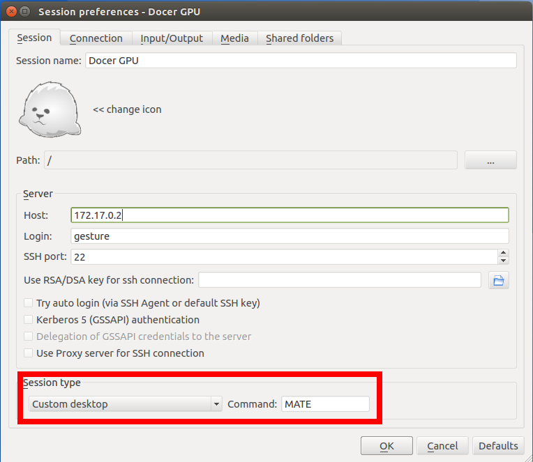
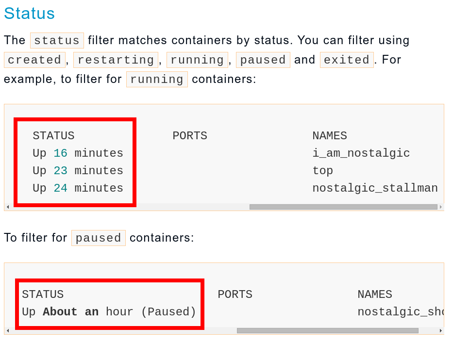
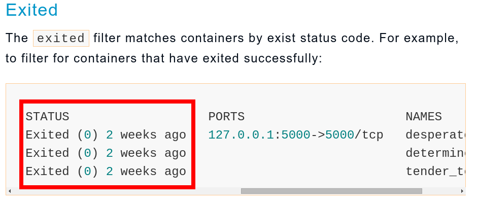

# Docker-Dev
=============================

INSTALL DOCKER AND NVIDIA-DOCKER
---------------------------------

### Installlation

#####Install Docker   
For Ubuntu please reference this link: [Docker-Installation](https://docs.docker.com/engine/installation/ubuntulinux/)

#####Install Nvidia-Docker   
For Ubuntu please reference this link: [Nvidia-Docker-Installation](https://github.com/NVIDIA/nvidia-docker)

NVIDIA DOCKER CONTAINER ISSUE
-------------------------------

### When build a Dockerfile

The temp Container for building time does not have "/usr/local/nvidia/" and "/dev/nvidia/*"   
So build library with CUDA inside Dockerfile maybe failed Because "No Such File or Directory"   

DOCKER CONTAINER QUICK START
---------------------------------

### 1. Install Docker and Nvidia-Docker

......

### 2. Build X2GO Base-Image which provide GUI by X2GO

cd ../Docker-Dev/X2GO/   
nvidia-docker build --force-rm -t joe/cuda-x2go:stable .

### 3. Build Image for OpenCV3.0.0 dev environment with PrimeSense module

cd ../Docker-Dev/OPENCV/   
nvidia-docker build --force-rm -t joe/cuda-x2go-opencv:stable .

### 4. Run OpenCV3.0 dev Container

nvidia-docker run -ti --rm --name=opencv_dev --privileged --device /dev/bus/usb:/dev/bus/usb joe/cuda-x2go-opencv:stable

#####Optional:
with -ti : give a tty interactive   
with --rm : delete container immediately after user exit   
with --name=container_name : assign container name
with --p hostPort:containerPort : map the host port to container   
with --privileged : give extended privileged to this container   
with --device hostDeviceNode:containerDeviceNode : map the host device node to container   

### 5. Use X2GO Client to access the Container

Install X2GO Client for Ubuntu:   
sudo add-apt-repository ppa:x2go/stable   
sudo apt-get update   
sudo apt-get install x2goclient   

#####Set use MATE environment

......

### 6. Start to Developer

......

HOWTO USE DOCKER CONTAINER CLI
---------------------------------

### 1.Build Docker Images:

nvidia-docker build --force-rm -t image-id:tag .     
nvidia-docker build --force-rm -f /path/to/Dockerfile -t image-id:tag .    

### 2.List local images:

nvidia-docker images

### 3.How to Start a Dev Container:

nvidia-docker run -ti --rm --name=your_dev_name -p 8024:22 --privileged --device /dev/bus/usb:/dev/bus/usb image-id:tag Opentional_COMMAND

#####Optional:   
with -v hostPath:containerPath that can mount Host file or directory to Container

### 4.Execute a COMMAND on a running Container

nvidia-docker exec -ti container-id COMMAND

#####Optional:   
with --user=user_name : set login user_name

### 5.List running and not running Container

nvidia-docker ps -a

#####Container Status:   

For Container in Exited and Paused status   
You can use:   
nvidia-docker start container-id(container-name)   
to start container   

For Container in Running status   
You can use:   
nvidia-docker stop container-id(container-name)   
to stop container   

Explanation from Docker website:   

### 6.Start and Stop the Container

nvidia-docker start container-id   
nvidia-docker stop container-id   

### 7.Copy file between Host and Container

nvidia-docker cp hostpath container-id:containerpath   
nvidia-docker cp container-id:containerpath hostpath   

### 8.Remove a not running Container

nvidia-docker rm container-id

#####Optional:   
Remove All not running container   
nvidia-docker rm $(nvidia-docker ps -aq)   

### 9.Remove a non-used image

nvidia-docker rmi image-id

#####Optional:   
Remove All untagged images:   
nvidia-docker rmi $(docker images | grep "^<none>" | awk "{print $3}")   

